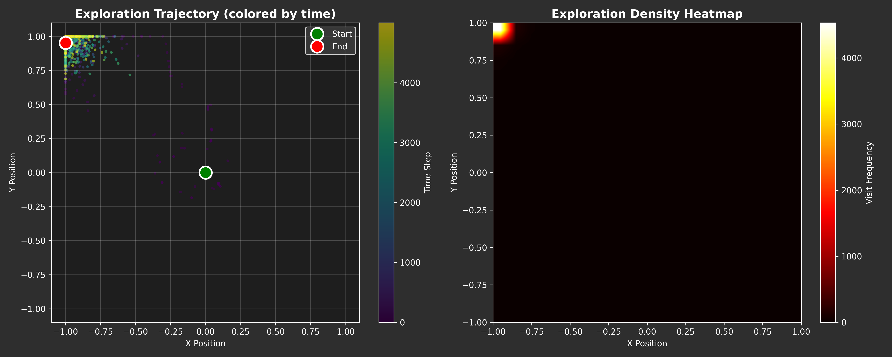
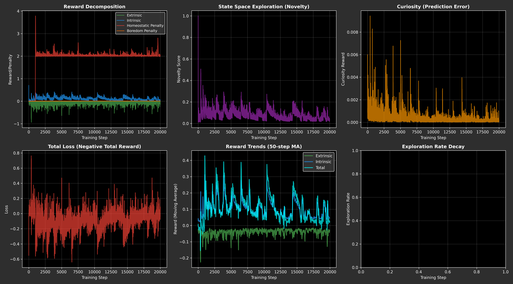
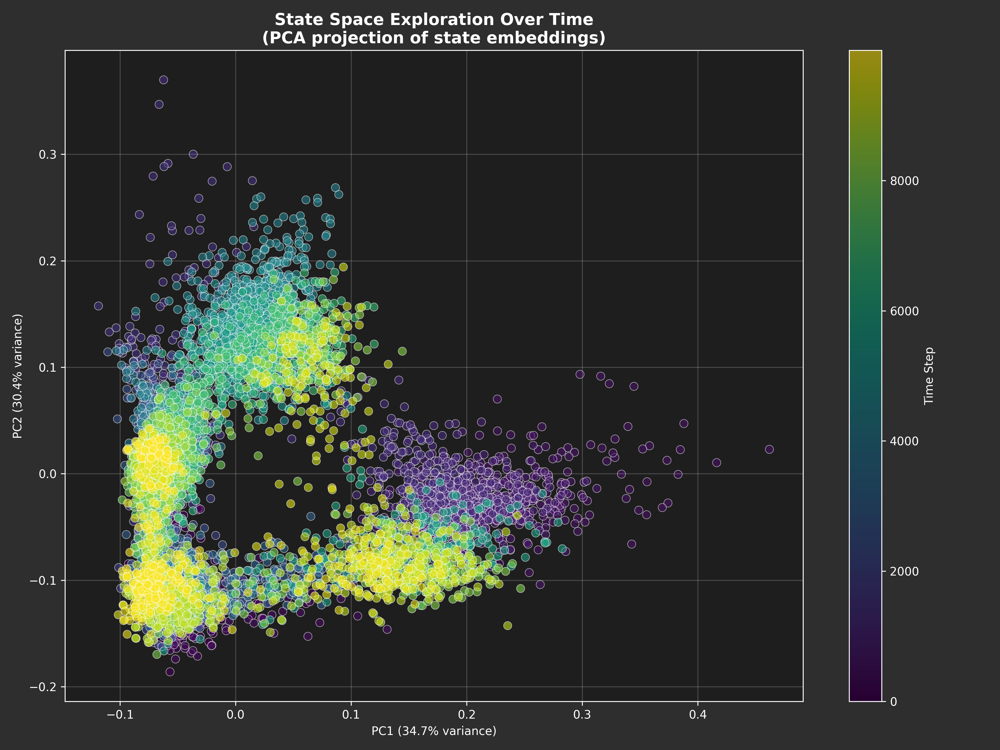
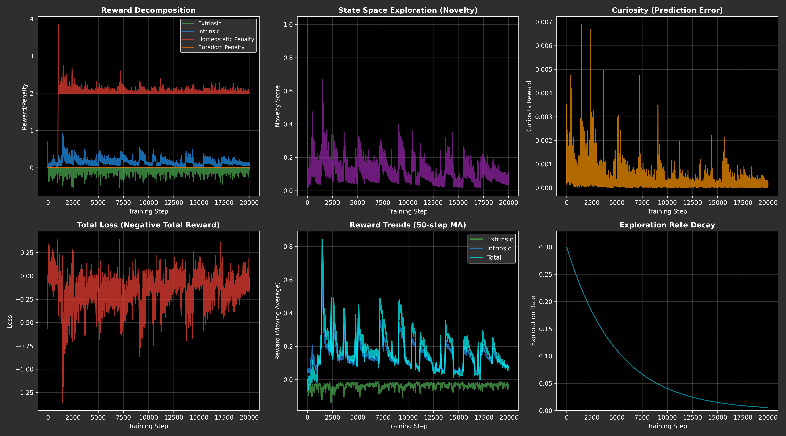
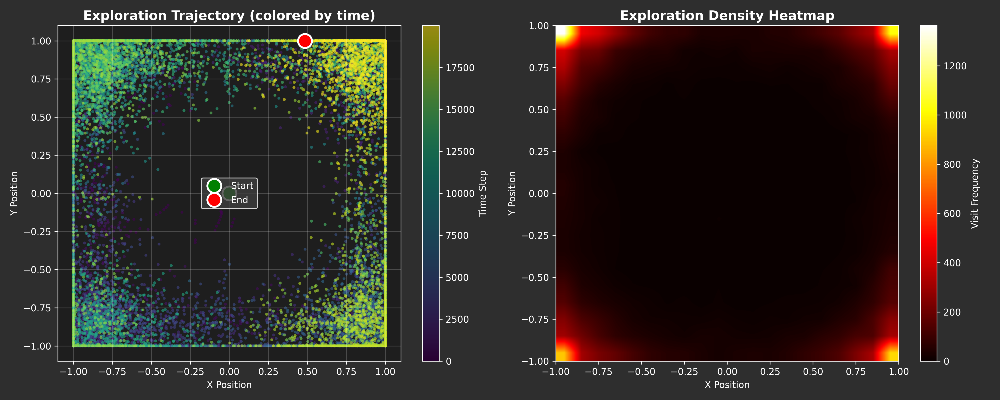

# SparkNet Explorer - Experiment Log

This document tracks each experimental run of the SparkNet Explorer system, documenting parameter changes and exploration behavior.

---

## Run 1: Baseline (2025-12-18 01:46)
**Config**: Default curiosity-driven exploration, no boundary penalties
**Result**: Agent stuck at corner [1.0, 1.0] immediately
**Observations**:
- No boundary penalty → corner has no cost
- Low novelty (0.02-0.06) insufficient to drive exploration
- Homeostasis stable (21/22 parameters healthy)

**Data**:
- Screenshots: [Metrics](exploration_runs/exploration_metrics_2025-12-18_01-46-05.png)
- Terminal Log: _(not saved - logging added in later runs)_

---

## Run 2: First Corner Stuck (2025-12-18 02:00)
**Config**: Added quadratic boundary penalty (margin=0.2, multiplier=2.0), periodic perturbations
**Result**: Agent stuck at corner [1.0, 1.0]
**Observations**:
- Boundary penalty too weak (0.16) vs distance reward (1.414)
- Perturbations every 50 steps insufficient
- State embeddings diverse but physical position clustered

**Data**:
- Screenshots: [Metrics](exploration_runs/exploration_metrics_2025-12-18_02-00-31.png) | [State Space](exploration_runs/exploration_state_space_2025-12-18_02-00-31.png) | [Trajectory](exploration_runs/exploration_trajectory_2025-12-18_02-00-31.png)
- Terminal Log: _(not saved)_

---

## Run 3: Stronger Penalties (2025-12-18 02:22)
**Config**: Increased boundary penalty (margin=0.3, multiplier=5.0), higher exploration rate (30%)
**Result**: Still stuck at corner [1.0, 1.0]
**Observations**:
- Stronger penalty still insufficient
- Exploration rate decay (0.9998) too fast
- Agent preferred corner despite negative net reward

**Data**:
- Screenshots: [Metrics](exploration_runs/exploration_metrics_2025-12-18_02-22-59.png) | [State Space](exploration_runs/exploration_state_space_2025-12-18_02-22-59.png) | [Trajectory](exploration_runs/exploration_trajectory_2025-12-18_02-22-59.png)
- Terminal Log: _(not saved)_

---

## Run 4: Dynamic Attractors + Satiation (2025-12-18 15:40)
**Config**: Added 4 dynamic attractors with satiation mechanism, attractor rotation every 100 steps, natural drift every 200 steps
**Result**: Agent stuck at corner [1.0, -1.0] (different corner!)
**Observations**:
- Attractors placed too far from spawn ([-0.6, 0.6] range)
- Agent never reached attractors to receive rewards
- Went to different corner than previous runs
- Homeostasis perfect (22/22 healthy)

**Data**:
- Screenshots: [Metrics](exploration_runs/exploration_metrics_2025-12-18_15-40-37.png) | [State Space](exploration_runs/exploration_state_space_2025-12-18_15-40-37.png) | [Trajectory](exploration_runs/exploration_trajectory_2025-12-18_15-40-37.png)
- Terminal Log: _(not saved - logging system added after this run)_

---

## Run 5: Adaptive Survival-Exploration Correlation (2025-12-18 17:29)
**Config**: Implemented dynamic feedback loop - homeostatic stress scales curiosity/novelty weights. Stress → 2x exploration boost. Logging system activated.
**Result**: Agent stuck at corner [-1.0, 1.0] but system dynamics TRANSFORMED
**Observations**:
- **Homeostatic penalty 10x higher** (sustained ~2.0 vs previous ~0.1) - system under active stress
- **Total reward > Intrinsic** for first time - rewards synergizing instead of competing
- **Adaptive correlation working** but corner still too attractive to overcome
- State embeddings more scattered - increased internal diversity
- Terminal log auto-saved successfully

**Visualizations**:


*Reward decomposition showing homeostatic penalty spike (~2.0) and total reward exceeding intrinsic for first time*


*State embeddings showing increased scatter and temporal progression from purple (early) to yellow (late)*


*Physical trajectory stuck at corner [-1, 1] despite internal diversity*

**Data Links**:
- Terminal Log: [Full Output](exploration_runs/logs/run_log_2025-12-18_17-29-01.md)

**Breakthrough**: First evidence of **reward system cooperation** - survival and exploration drives amplifying each other rather than competing. Internal dynamics improved even though spatial exploration unchanged.

---

## Run 6: Long-Term Adaptive Dynamics (2025-12-18 18:19)
**Config**: 20,000 steps (4x longer) to test convergence behavior with adaptive correlation active.
**Result**: Agent stuck at corner [1.0, 1.0] - **confirmed stable attractor**
**Observations**:
- **Exploration rate collapsed**: 0.25 → 0.0055 (nearly zero by end)
- **Diversity collapsed**: 0.30 → 0.06 (network converging to fixed point)
- **Curiosity dead**: 0.0000 (perfect predictions = no surprise = no drive)
- **Novelty dying**: 0.05 → 0.008 (everything became familiar)
- **21/22 parameters healthy** throughout - corner IS a healthy state
- System reached **true equilibrium** - not temporary behavior

**Visualizations**:


*Long-term convergence showing exploration rate decay to near-zero and reward stabilization*


*State embeddings showing convergence - diversity collapse from 0.30 to 0.06*


*20k steps at same corner [1, 1] - confirmed stable attractor, not transient state*

**Data Links**:
- Terminal Log: [Full Output](exploration_runs/logs/run_log_2025-12-18_18-19-34.md)

**Critical Discovery**: Corner is a **true stable equilibrium**, not temporary. System converges and stays forever. Adaptive correlation insufficient to escape - need fundamentally different mechanism (forced perturbations, attractor placement at spawn, or escape threshold).

---

## Run 7: Triple Corner-Breaking Solutions (2025-12-18 19:58)
**Config**: Implemented three solutions: (1) Attractors at spawn [0,0], (2) Boundary noise (random kicks near edges), (3) Boredom penalty (curiosity < 0.001 → penalty)
**Result**: **BREAKTHROUGH - Agent explores entire space!** Visits all four quadrants
**Observations**:
- **Agent MOVES** - positions change: [0.3, -0.9] → [-1, 0.2] → [1, 0.8] → [-0.7, 0.9] → [1, -0.7]
- **No corner convergence** - bounces between edges instead of settling
- **Diversity stable** - 0.37 → 0.21 (healthy decline, not collapse)
- **Novelty sustained** - 0.16 → 0.03 (gradual decrease, not dead)
- **21-22/22 parameters healthy** throughout - system stable while exploring
- Solutions working together: attractors pull from spawn, noise breaks edge predictability, boredom prevents settling

**Visualizations**:


*Reward dynamics showing sustained activity - boredom penalty (orange) prevents collapse*


*State embedding diversity maintained - no convergence to fixed point*


*Physical trajectory showing movement across all quadrants - CORNER TRAP BROKEN*

**Data Links**:
- Terminal Log: [Full Output](exploration_runs/logs/run_log_2025-12-18_19-58-31.md)

**Major Breakthrough**: Triple defense successfully breaks corner convergence. System now explores continuously instead of settling into stable attractor. Next: optimize parameters to maximize coverage efficiency.

---

## Run 8: Reproducible Emergent Structure (2025-12-18 20:56)
**Config**: Same triple defense as Run 7 - testing reproducibility with different random seed
**Result**: Agent explores continuously - **same 4-cluster topology emerges**
**Observations**:
- **Reproducible structure** - PCA shows identical 4-cluster pattern as Run 7
- **Four attractor basins**: bottom-left + top-center + upper-right + lower-right
- **Not random** - different initialization converges to same state space organization
- **Diversity stable** - 0.30 → 0.17 (similar pattern to Run 7)
- **21/22 parameters healthy** - system remains viable throughout
- Proof of **stable emergent topology** dictated by reward landscape and constraints

**Visualizations**:


*Reward dynamics consistent with Run 7 - boredom penalty maintains exploration*


*Four-cluster pattern identical to Run 7 - reproducible emergent structure in PCA space*


*Continuous exploration across all quadrants - no corner convergence*

**Data Links**:
- Terminal Log: [Full Output](exploration_runs/logs/run_log_2025-12-18_20-56-04.md)

**Discovery**: System discovers **same state space architecture** across runs. Four-cluster topology is not random artifact but **stable emergent organization** created by interaction of spawn attractors (1 center + 3 ring) and boundary dynamics. Network self-organizes into this structure regardless of initialization.

---

## Key Learnings

1. **Boundary penalties alone insufficient** - Agent finds corners attractive despite penalties
2. **Attractor placement critical** - Must intercept agent at spawn [0,0] before corners reached
3. **Predictability kills exploration** - Corners are easy to predict → curiosity dies → no drive to leave
4. **Multiple mechanisms needed** - Single solution fails; triple defense (attractors + noise + boredom penalty) succeeds
5. **Adaptive correlation enables cooperation** - Stress-driven exploration creates reward synergy
6. **Corner trap broken** - Triple defense prevents convergence to stable equilibrium
7. **Emergent topology reproducible** - System self-organizes into 4-cluster state space architecture across different runs

## Next Steps

- [x] Implement adaptive survival-exploration correlation (Run 5 - SUCCESS)
- [x] Add terminal output logging system (Run 5 - SUCCESS)
- [x] Test long-term adaptive dynamics (Run 6 - confirmed corner equilibrium)
- [x] Place attractors at spawn [0,0] (Run 7 - SUCCESS)
- [x] Add boundary noise mechanism (Run 7 - SUCCESS)
- [x] Implement boredom penalty (Run 7 - SUCCESS)
- [ ] Optimize attractor radius and satiation parameters for better coverage
- [ ] Test different boredom threshold values (currently 0.001)
- [ ] Analyze trajectory efficiency - distance traveled vs area covered

---

## Template for New Runs

```markdown
## Run X: [Title] (YYYY-MM-DD HH:MM)
**Config**: [What changed in this experiment]
**Result**: [Brief outcome - where did agent go?]
**Observations**:
- [Key finding 1]
- [Key finding 2]
- [Key finding 3]

**Data**:
- Screenshots: [Metrics](exploration_runs/exploration_metrics_TIMESTAMP.png) | [State Space](exploration_runs/exploration_state_space_TIMESTAMP.png) | [Trajectory](exploration_runs/exploration_trajectory_TIMESTAMP.png)
- Terminal Log: [Full Output](exploration_runs/logs/run_log_TIMESTAMP.md)
```
