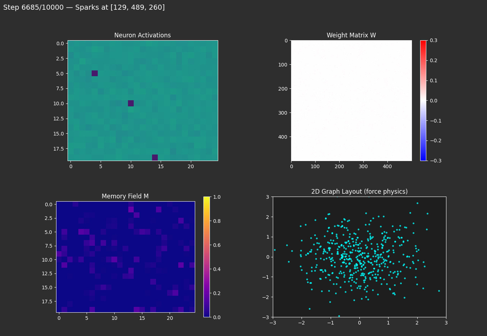

# sparknet-emergence

Self-organizing neural network exploring emergent behavior through spark-based learning.

## Quick Setup

```bash
pip install torch matplotlib
python sparknet_alpha.py
```

**GPU (NVIDIA):** Visit pytorch.org for CUDA-specific install command.

## What It Does

Mobile "sparks" traverse a neural network, strengthening connections as they move. A memory field biases future movement toward frequently-visited areas. The system self-organizes through Hebbian-like learning with global decay.

**Recent Updates:**

*Network Behavior:*
- **Saturation-Aware Movement**: Sparks avoid over-activated neurons (>0.99) to prevent concentration in hot spots. Forces broader exploration and more distributed patterns instead of repeatedly visiting the same high-activity neurons.

*New Visualization:*
- **Learning Temperature Graph**: Tracks graph motion over time as a "thermometer" for learning activity. High motion = active reorganization, low motion = stable structure. Sudden drops reveal pattern formation moments.

**Features:**
- Interactive parameter editor with live feedback
- Play/Pause/Stop controls
- Auto GPU/CPU detection
- Real-time visualization: neuron activations, weight matrix, memory field, force-directed graph, learning temperature

## Repository Structure
- **sparknet_alpha.py** - Main version with interactive interface
- **sparknet_explorer/** - New branch: curiosity-driven exploration architecture with intrinsic motivation
- **old/** - Previous iterations (optional, for exploring early approaches)

### SparkNet Explorer

Alternative architecture exploring emergent behavior through **intrinsic motivation**. Instead of manual sparks, uses triple reward system:
- Extrinsic (task performance) + Intrinsic (curiosity + novelty) + Homeostatic (parameter stability)

Agent explores 2D space driven by prediction errors and state novelty. Still investigating emergent exploratory behavior.

📊 **Experiment tracking:** See [EXPLORER_RUNS.md](EXPLORER_RUNS.md) for detailed run logs and findings.

## Key Findings

**Sequential Bias Problem:** Early versions showed diagonal patterns in weight matrices - the system learned simple ordered sequences instead of complex structure. This revealed emergence requires careful constraint design. Each "failure" clarifies what blocks emergent behavior.



## Observations

The 2D force-directed graph shows fluid-like dynamics during training. At equilibrium, neurons distribute like gas molecules in a container. This suggests networks may follow entropy laws similar to physical systems when settling into stable states.

No striking emergent structures yet, but thermodynamic-like behavior is intriguing and worth further investigation.

## Research Goal

Understanding self-organization in neural networks - how structure emerges from randomness. Long-term aim: contribute to research on emergence, internal representations, and architectural requirements for consciousness in AI systems.

**Status:** Early-stage. Iterating on memory systems, spark movement strategies, and learning rules.


## Honestly my head fried now, interface make experiment more easy to test, but I feel there will be trade offs